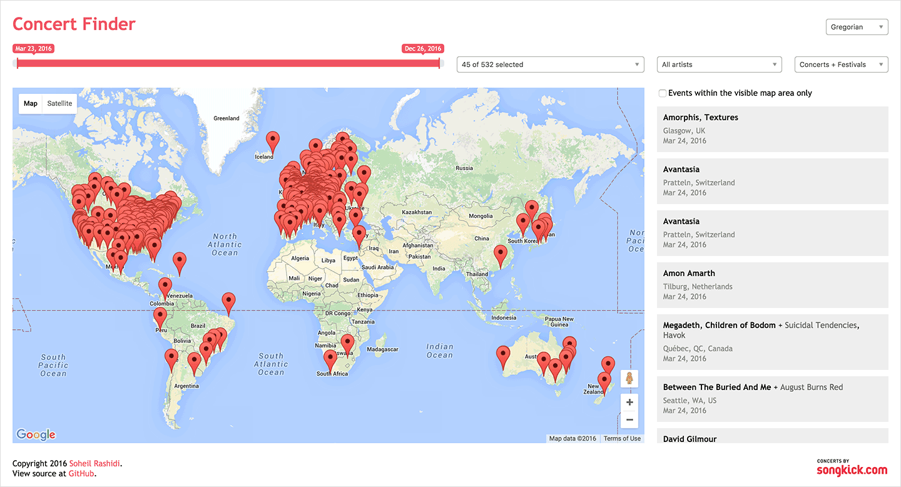

# Concert Finder
An alternative user interface for [songkick.com](http://songkick.com) which lets you easily find and discover concerts by your favorite artists anywhere in the world.



## Live demo

http://concertfinder.soheilrashidi.com

## Setup

1. Get a [Songkick API key](https://www.songkick.com/developer).
2. Get a [Google Maps API key](https://developers.google.com/maps).

3. Clone the repository:

   ```
   git clone git@github.com:soheilpro/concert-finder.git
   ```

4. Create a config.json file in the src directory with the following content:

   ```
   {
     "songkick.apikey": "YOUR_SONGKICK_API_KEY",
     "google.maps.apikey": "YOUR_GOOGLE_MAPS_API_KEY"
   }
   ```

5. Run the application:

   ```
   node index.js
   ```

## Version History
+ **1.0**
	+ Initial release.

## Author
**Soheil Rashidi**

+ http://soheilrashidi.com
+ http://twitter.com/soheilpro
+ http://github.com/soheilpro

## Copyright and License
Copyright 2016 Soheil Rashidi

Licensed under the The MIT License (the "License");
you may not use this work except in compliance with the License.
You may obtain a copy of the License in the LICENSE file, or at:

http://www.opensource.org/licenses/mit-license.php

Unless required by applicable law or agreed to in writing, software
distributed under the License is distributed on an "AS IS" BASIS,
WITHOUT WARRANTIES OR CONDITIONS OF ANY KIND, either express or implied.
See the License for the specific language governing permissions and
limitations under the License.
